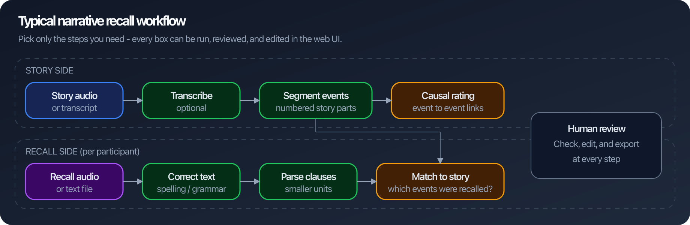
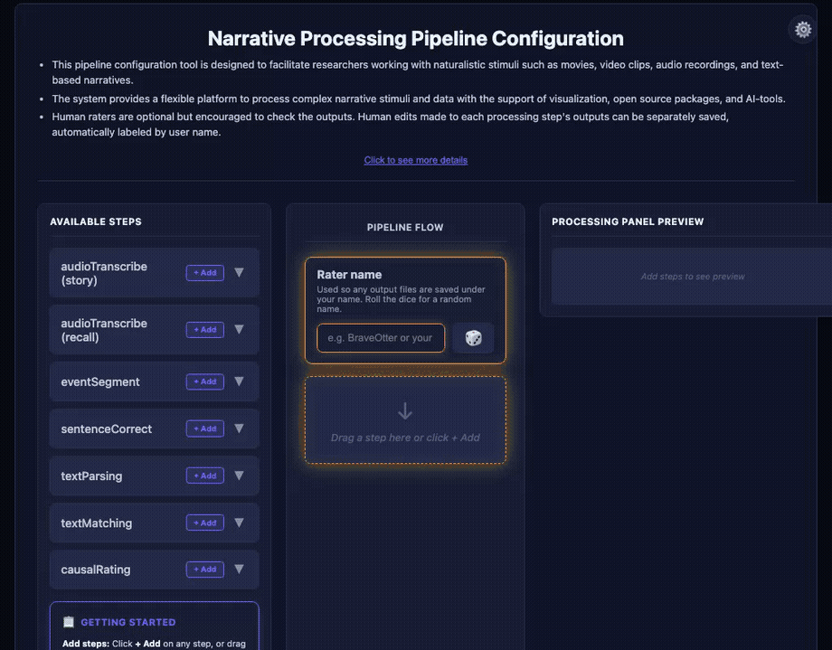
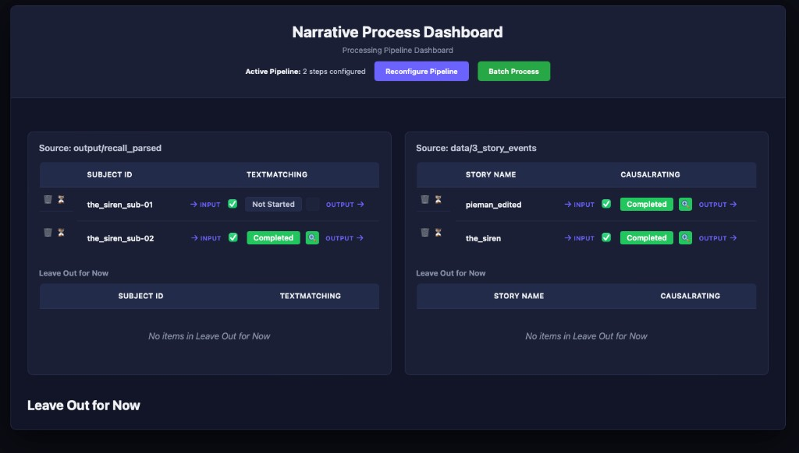
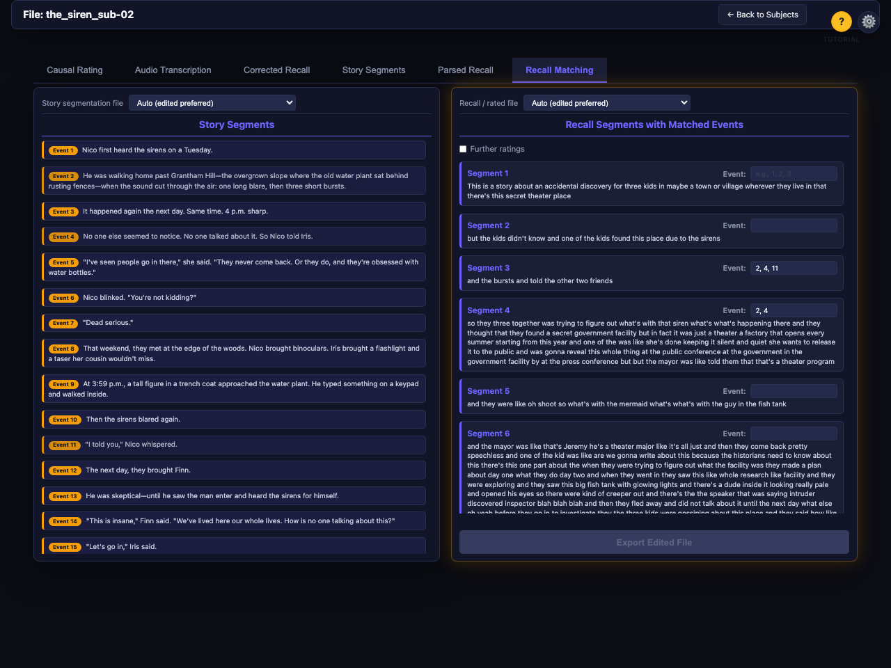
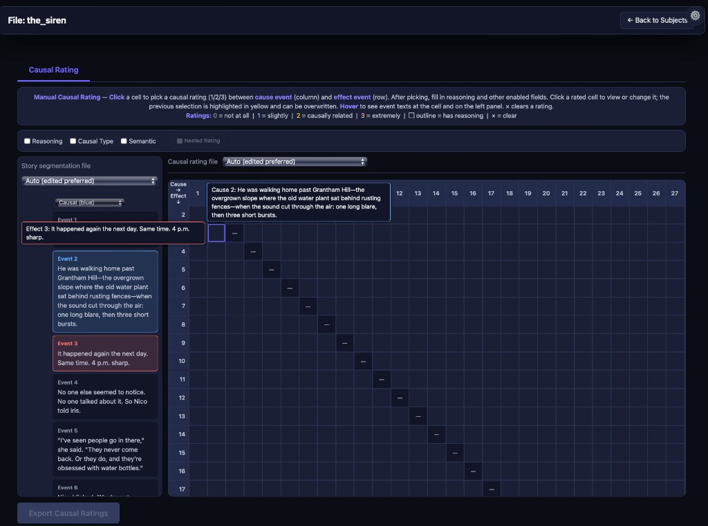

<p align="center">
  
</p>

<h1 align="center">narRaters</h1>

<h3 align="center">Turn complex narratives into structured, reviewable data — with a web UI at every step</h3>

<p align="center"><strong>GitHub:</strong> <a href="https://github.com/xianNeuro/narRaters">github.com/xianNeuro/narRaters</a> · <strong>PyPI:</strong> <a href="https://pypi.org/project/narraters/">narraters</a></p>

<p align="center">
  <a href="https://pypi.org/project/narraters/"></a>
  <a href="https://github.com/xianNeuro/narRaters"></a>
  <a href="LICENSE"></a>
  <a href="https://github.com/xianNeuro/narRaters/issues"></a>
</p>

<p align="center">
  <a href="https://xianneuro.github.io/narRaters/">🏠 Project home</a>
  ·
  <a href="https://pypi.org/project/narraters/">📦 PyPI</a>
  ·
  <a href="narRater_Tutorial.pdf">📖 Tutorial (PDF)</a>
  ·
  <a href="https://github.com/xianNeuro/narRaters/issues">🐛 Issues</a>
  ·
  <a href="https://github.com/xianNeuro/narRaters/issues/new?template=feedback">💬 Feedback</a>
</p>

<br>

## What is narRaters?

**narRaters** (*narrative* + *raters*) is an open-source software on [GitHub (xianNeuro/narRaters)](https://github.com/xianNeuro/narRaters) that helps process complex narratives (e.g., audio book, text-based stories, interviews, conversations, etc.) for memory, language processing, causal reasoning, and LLM research.

Imagine you ran a memory study: participants listened to a story, then recalled what they remembered (spoken or typed). Before you can analyze memory, you need structured data — what happened in the story, what each person recalled, and how those pieces connect.

**narRaters** helps you get there. It runs common narrative-processing steps (transcribe audio, split a story into events, clean up recall text, parse recalls into clauses, match recalls back to story events, rate causal links between events) and gives you a web interface to review and fix outputs before exporting.

Works for audio or text, stories or other long narratives (including movie annotations), and human-only or human-vs-LLM workflows.

| You have… | narRaters helps you… |
|---|---|
| Story audio or transcript | Transcribe it and break it into numbered **events** |
| Participant recall files | Correct spelling, split into **clauses**, and **match** each clause to story events |
| A segmented story | **Rate causal links** between event pairs (did event A lead to event B?) |
| Automated or AI outputs | **Screen and edit** them in the browser, then export signed-off files |

<p align="center">
  
</p>

---

## Get started in 3 steps

<table>
  <tr>
    <td width="72" align="center"><strong>1</strong></td>
    <td><strong>Download & open</strong><br>Get the <a href="https://github.com/xianNeuro/narRaters/archive/refs/tags/v0.3.6.zip">ZIP</a>, unzip, and double-click <code>narRater.app</code> (macOS) or <code>narRaters_installer.bat</code> (Windows). Needs <a href="https://www.python.org/downloads/">Python 3.10+</a>.</td>
  </tr>
  <tr>
    <td align="center"><strong>2</strong></td>
    <td><strong>Pick your pipeline</strong><br>Your browser opens to the pipeline builder. Drag in only the steps you need (e.g. segment → match → causal rate). Bundled demo data is already loaded so you can explore immediately.</td>
  </tr>
  <tr>
    <td align="center"><strong>3</strong></td>
    <td><strong>Run, review, export</strong><br>On the dashboard, click a cell to run a step. Open the magnifying-glass icon to inspect results, edit in the browser, and export when you are satisfied.</td>
  </tr>
</table>

<p><strong>Or via terminal</strong> (Python 3.10+; no ZIP download). Run from the folder that contains your <code>data/</code> and <code>output/</code> directories (or set <code>NARRATERS_PROJECT_ROOT</code> to that path):</p>

```bash
python --version                              # must show 3.10 or newer
python3 -m pip install narraters --upgrade    # wait for “Successfully installed”
cd /path/to/your/project                      # folder with data/ and output/
narraters serve                               # browser opens to the pipeline builder
```

Then continue with **steps 2–3** above — pick your pipeline, run steps on the dashboard, review, and export.

> **First time?** Follow the illustrated **[Tutorial PDF](narRater_Tutorial.pdf)** or jump to [Quick start](#quick-start) for install troubleshooting.

---

## See the app

<p align="center">
  
  <br>
  <em>① Dashboard &nbsp;→&nbsp; ② Recall matching &nbsp;→&nbsp; ③ Causal rating</em>
</p>

<table>
  <tr>
    <td align="center" width="33%" valign="top">
      <p><strong>① Pipeline dashboard</strong></p>
      <br>
      <sub>See every subject/story, run steps, and open results. Green = done; click a cell to process.</sub>
    </td>
    <td align="center" width="33%" valign="top">
      <p><strong>② Recall matching</strong></p>
      <br>
      <sub>Story events on the left; recall segments on the right. Assign which events each recall segment refers to.</sub>
    </td>
    <td align="center" width="33%" valign="top">
      <p><strong>③ Causal rating</strong></p>
      <br>
      <sub>Click a grid cell to rate how strongly one story event caused another (0–3 scale).</sub>
    </td>
  </tr>
</table>

---

## Table of contents

- [What is narRaters?](#what-is-narraters)
- [Get started in 3 steps](#get-started-in-3-steps)
- [See the app](#see-the-app)
- [Quick start](#quick-start)
- [Pipeline overview](#pipeline-overview)
- [Installation](#installation)
- [Where to put your data](#where-to-put-your-data)
- [Using the web interface](#using-the-web-interface)
- [Command-line pipeline](#command-line-pipeline)
- [Prompt templates](#prompt-templates)
- [Validation / testing](#validation--testing)
- [Research background](#research-background)
- [Library / Python use](#library--python-use)
- [Project layout](#project-layout)
- [Further reading](#further-reading)
- [Author](#author)
- [Acknowledgements](#acknowledgements)
- [License](#license)

---

## Quick start

### Double-click launcher (ZIP download)

1. **[Download the ZIP (v0.3.6)](https://github.com/xianNeuro/narRaters/archive/refs/tags/v0.3.6.zip)** — latest release snapshot — and unzip it. (Or use green **Code ▾** → **Download ZIP** on GitHub for the current `main` branch.)
2. **Open the launcher:** **macOS** — double-click **`narRater.app`**. **Windows** — double-click **`narRaters_installer.bat`**. **Linux** — in Terminal, `cd` into the folder and run `bash install.sh`.
   - **macOS** if Gatekeeper blocks you:
     - Try **Finder** → **control-click** **`narRater.app`** → **Open** → **Open** in the warning dialog (when those choices exist).
     - If there is **no Open** entry or launching still fails: **System Settings** → **Privacy & Security** → scroll to **Security**. After macOS rejects the app once, look for **`narRater` was blocked…** (wording varies) and click **Allow Anyway** or **Open Anyway**, authenticate, then open **`narRater.app`** again (that control may disappear after ~an hour — try launching once more to refresh it).
     - More (including stripping quarantine from a downloaded ZIP): [Installation](#installation).
3. **A browser tab opens at `http://127.0.0.1:5000`** with bundled examples already loaded — start clicking.

### Via terminal (PyPI)

1. **Check Python** — you need **3.10 or newer**:

```bash
python --version
```

If that fails or shows an older version, try `python3 --version` or install [Python 3.10+](https://www.python.org/downloads/).

2. **Install or upgrade** from PyPI and confirm it finishes without errors:

```bash
python3 -m pip install narraters --upgrade
```

You can verify with `narraters --version`.

3. **Start the web UI** — your browser should open to the pipeline builder:

```bash
narraters serve
```

> Needs **[Python 3.10+](https://www.python.org/downloads/)**. If anything fails, jump to [Installation](#installation) for the full walkthrough and troubleshooting.

---

## Pipeline overview

**Six optional steps — use any subset, in any order.** Each step can run automatically (rules, local models, or cloud APIs) and then be reviewed in the browser.

| Plain English | Step ID | Input → output (typical) |
|---|---|---|
| Transcribe audio | **`audioTranscribe`** | audio file → text transcript |
| Split story into events | **`eventSegment`** | story transcript → numbered event list |
| Fix recall spelling/grammar | **`sentenceCorrect`** | raw recall text → corrected text |
| Split recall into clauses | **`textParsing`** | corrected recall → clause segments |
| Match recall to story | **`textMatching`** | recall segments + story events → rated matches |
| Rate event causality | **`causalRating`** | story events → cause–effect ratings |

<details>
<summary><strong>Full step reference (commands &amp; folders)</strong></summary>

In typical recall work, **`audioTranscribe`** / **`eventSegment`** target the **story**, **`sentenceCorrect`**–**`textMatching`** each **subject recall**, and **`causalRating`** the **story event list** — but text-only projects skip Step 1, and you can equally run just **`eventSegment` + `causalRating`** or **`sentenceCorrect` → `textParsing` → `textMatching`**. Every step is available from the **GUI** or **`narraters` CLI**, has a lightweight default method, and supports hand-editing afterward.

| # | Step ID | What it does | Terminal command | Default in / out |
|---|---------|--------------|------------------|------------------|
| 1 | **`audioTranscribe`** | Audio recordings → text (Whisper/WhisperX); story vs recall via `audioScope` or `--kind` | `narraters transcribe` | `data/4_recall_audio/` (or `data/1_story_audio/` with `--kind story`) → `output/*_audio-transcribed/` |
| 2 | **`eventSegment`** | Story transcript → numbered events | `narraters segment` | `data/2_story_transcript/` → `data/3_story_events/` |
| 3 | **`sentenceCorrect`** | Fix spelling/grammar in recall text (no rewriting) | `narraters correct` | `data/5_recall_texts/` → `output/recall_corrected/` |
| 4 | **`textParsing`** | Corrected recall → clause-level segments | `narraters parse` | `output/recall_corrected/` → `output/recall_parsed/` |
| 5 | **`textMatching`** | Recall segments ↔ story events | `narraters match` | `output/recall_parsed/` + `data/3_story_events/` → `output/recall_rated/` |
| 6 | **`causalRating`** | Causal strength of every story-event pair | `narraters rate` | `data/3_story_events/` → `output/causal_rated/` |

</details>

For each step, the GUI runs the same backends as the CLI. **Available methods, flags, and examples** are under **[Command-line pipeline](#command-line-pipeline)** below.

---

## Installation

**Step 1 — Install [Python 3.10 or newer](https://www.python.org/downloads/).**  Windows: check **“Add python.exe to PATH”** in the Python installer.

**Step 2 — Download the project.** Use the **[release ZIP (v0.3.6)](https://github.com/xianNeuro/narRaters/archive/refs/tags/v0.3.6.zip)** link in [Quick start](#quick-start), or on the [GitHub repo page](https://github.com/xianNeuro/narRaters) click the green **Code ▾** button → **Download ZIP**, then unzip wherever you like (e.g. `~/Downloads/`, your desktop, `~/Documents/`). You'll get a folder called **`narRaters-0.3.6`** (release ZIP), **`narRaters-main`** (default GitHub ZIP), or **`narRaters`** if you used `git clone`. Everything below assumes you're inside that folder.

**Step 3 — Launch the app by double-clicking the right file for your OS.**

| Your OS | Double-click… | What happens |
|---------|---------------|--------------|
| **macOS** | **`narRater.app`** | Sets up a Python virtual environment, installs dependencies, opens your browser |
| **Windows** | **`narRaters_installer.bat`** | Same flow, in a Command Prompt window |
| **Linux** | open Terminal in the folder, run `bash install.sh` | Same flow (Linux has no double-click convention here) |

**Step 4 — Done.** Your browser opens **`http://127.0.0.1:5000/pipeline-config`**. Put your data in **`data/`** inside the project folder (bundled examples are already there). Restart later by double-clicking the same file.

### Troubleshooting

| If you see… | Do this |
|--------------|--------|
| `Python 3.10+ required` | Install [Python 3.10+](https://www.python.org/downloads/), close and reopen any Terminal, run again. |
| Blank page on `localhost:5000` | Visit **`http://127.0.0.1:5000/pipeline-config`** instead (IPv6/IPv4 quirk on some Macs). |
| **macOS:** Gatekeeper / “cannot check for malicious software” / no **Open** in the right-click menu | **1.** In **Finder**, try **control-click** **`narRater.app`** → **Open**, then confirm **Open** if the dialog offers it — [Apple’s Gatekeeper overrides](https://support.apple.com/guide/mac-help/mh40617/mac). **2.** If that path is missing or still blocks: **System Settings** → **Privacy & Security** → scroll to **Security** — after a failed launch, macOS often shows **`narRater` was blocked** (wording varies) with **Allow Anyway** or **Open Anyway**; click it, enter your password, then launch **`narRater.app`** again (that button may only appear for a limited time after the block). **3.** Downloaded folder still quarantined: in Terminal, `xattr -dr com.apple.quarantine /path/to/narRaters-main`, then try **1** or **2** again. |
| **macOS:** “narRater couldn't find the narRaters project folder” | macOS **App Translocation** ran the app from a temp copy. Run `xattr -dr com.apple.quarantine ~/Downloads/narRaters-main` (adjust path) and double-click again, or use the [command-line install](#alternate-install-command-line) below. |
| **Windows:** SmartScreen warns about `narRaters_installer.bat` | Click **More info** → **Run anyway**. |
| Port 5000 already in use | The installer auto-tries 5001–5010 and prints the URL. To free 5000: macOS → System Settings → General → AirDrop & Handoff → turn off **AirPlay Receiver**. |

### Alternate install (command line)

For users who prefer the terminal, or who want to install the app without keeping the project folder around. Two flavors — pick whichever you prefer.

<details>
<summary><b>(a) <code>git clone</code> + <code>install.sh</code> (gets you the project folder, with bundled examples)</b></summary>

```bash
# macOS / Linux
cd ~ && git clone https://github.com/xianNeuro/narRaters.git && cd narRaters && bash install.sh
```

```bat
:: Windows
cd %USERPROFILE% && git clone https://github.com/xianNeuro/narRaters.git && cd narRaters && narRaters_installer.bat
```

This is what `narRater.app` does under the hood, just without the click. `git: command not found`? On macOS: `xcode-select --install`. On Windows: install [Git for Windows](https://git-scm.com/download/win).
</details>

<details>
<summary><b>(b) PyPI (bundled examples — copied into your current folder on first <code>narraters serve</code>)</b></summary>

Use this if you already have a working Python venv and just want the **`narraters`** command. On first launch, example **`data/`** and **`output/`** folders are copied into whatever directory you run from (unless you already have a project folder, or set **`NARRATERS_PROJECT_ROOT`**).

Always use **`python3 -m pip`**, not bare `pip` — on macOS, `pip` often points at an old Python and will say *“no matching distribution”*.

```bash
python3 --version        # must be 3.10 or newer
mkdir -p ~/narRaters-demo && cd ~/narRaters-demo
python3 -m venv .venv
source .venv/bin/activate     # Windows: .venv\Scripts\activate
python3 -m pip install --upgrade pip
python3 -m pip install narraters --upgrade
narraters serve
```

Package: [`narraters`](https://pypi.org/project/narraters/) (all lowercase). For the full project folder (launchers, tutorial PDF, etc.), use the ZIP or git clone install above.
</details>

<details>
<summary><b>Optional extras (Whisper, cloud APIs, local Gemma, etc.)</b></summary>

Inside the project folder, with the venv activated:

```bash
python3 -m pip install -e ".[audio]"     # Whisper transcription
python3 -m pip install -e ".[api]"       # Anthropic / OpenAI
python3 -m pip install -e ".[nlp]"       # spaCy segmentation
python3 -m pip install -e ".[grammar]"   # grammar checker
python3 -m pip install -e ".[local-llm]" # local Gemma
python3 -m pip install -e ".[match]"     # rmatch
python3 -m pip install -e ".[all]"       # api + match
```

PyPI users: `python3 -m pip install "narraters[audio]"`, etc.

Heavy methods (`audio`, `local-llm`, `match`) pull multi-GB packages — the app shows a RAM/disk preflight before downloading. **Ollama (local Gemma):** install [Ollama](https://ollama.com), then `ollama pull gemma4:e4b`. **API keys:** copy `.env.example` to `.env` and edit (see [`SETUP_API.md`](SETUP_API.md)).
</details>

<details>
<summary><b>Developers</b></summary>

`install.sh` already does an editable install. To work on the codebase:

```bash
git clone https://github.com/xianNeuro/narRaters.git
cd narRaters
python3 -m venv .venv && source .venv/bin/activate && python3 -m pip install -e .
```

Build the standalone macOS app for icon testing: `bash packaging/macos/build_app_bundle.sh`.  Build the slim repo-root launcher: `bash packaging/macos/build_repo_app.sh`.
</details>

---

## Where to put your data

After [installation](#installation), place files so the paths match what you configured on the **pipeline** page (defaults below are relative to the **project root**). You can **remap** any step’s input/output folders there without moving data.

| You have… | Put it in… | Format / naming |
|---|---|---|
| Story transcript (text) | `data/2_story_transcript/` | `{story}.txt` — plain UTF-8 text, one story per file |
| Story event list (pre-segmented) | `data/3_story_events/` | `{story}_events.xlsx` — columns `event`, `story_texts` |
| Subject recall text | `data/5_recall_texts/` | `{subj_id}.txt` — e.g. `the_siren_sub-01.txt` |
| Story audio (optional, Step 1) | `data/1_story_audio/` | `.wav` / `.mp3` / `.m4a`, named by story |
| Recall audio (optional, Step 1) | `data/4_recall_audio/` | `.wav` / `.mp3` / `.m4a`, named by subject |

Outputs are written under `output/` — one subdirectory per step (`output/recall_corrected/`, `output/recall_parsed/`, `output/recall_rated/`, …). A smaller alternate layout lives in **`demo/data/`** (lighthouse story, three recall `.txt` files).

### Bundled examples (`pieman_edited`, `the_siren`)

The repository ships **realistic sample inputs and outputs** under `data/` and `output/` so you can see accepted naming and file types before adding your own study. Your private files in those folders stay untracked (see `.gitignore`); only the examples below are committed.

**Stories:** **`pieman_edited`** (story audio + transcript + events) and **`the_siren`** (transcript, events, two recall subjects).

| Role | Folder | Example file(s) |
|------|--------|-----------------|
| Story audio (input) | `data/1_story_audio/` | `pieman_edited.wav` |
| Story transcript (input) | `data/2_story_transcript/` | `pieman_edited.txt`, `the_siren.txt` |
| Story events (input) | `data/3_story_events/` | `pieman_edited_events.xlsx`, `the_siren_events.xlsx` |
| Recall audio (input) | `data/4_recall_audio/` | Your own `.wav` / `.mp3` / `.m4a` / `.mp4` (not shipped publicly) |
| Recall text (input) | `data/5_recall_texts/` | `the_siren_sub-01.txt`, `the_siren_sub-02.txt` |
| Story transcription (output) | `output/story_audio-transcribed/` | `pieman_edited.txt` |
| Recall transcription (output) | `output/recall_audio-transcribed/` | `the_siren_sub-01.txt`, `the_siren_sub-02.txt` |
| Spell/grammar correction (output) | `output/recall_corrected/` | `the_siren_sub-01.txt`, `the_siren_sub-02.txt` |
| Parsed recall (output) | `output/recall_parsed/` | `the_siren_sub-01_parsed.xlsx`, `the_siren_sub-02_parsed.xlsx` |
| Recall ↔ events (output) | `output/recall_rated/` | `the_siren_sub-02_rate-recall-test_mode.xlsx` (method slug in filename) |
| Causal ratings (output) | `output/causal_rated/` | `pieman_edited_causal-linguistic.xlsx`, `the_siren_causal-linguistic.xlsx` |

**Quick try:** after install, point a pipeline at the default folders above and run **`sentenceCorrect` → `textParsing` → `textMatching`** on `the_siren_sub-01` / `the_siren_sub-02`, or open the bundled **`output/`** files in Excel to inspect column layouts. Story **`pieman_edited`** is useful for **`audioTranscribe`** (large `.wav`) and **`causalRating`** on `pieman_edited_events.xlsx`.

**File versioning is a core feature.** Automated runs write `{subj_id}_{method}.ext` (or `{story}_…` for story-level steps); your hand-edited versions are saved as `{subj_id}_{ratername}-edit.ext` and never overwrite the originals. The web UI lets you switch between versions via a dropdown, and the `-edit` files are what you export for analysis.

---

## Using the web interface

The app is a **local Flask site** at **`http://127.0.0.1:5000`**. After the initial install, restart it any time by:

| How | Where |
|-----|-------|
| Double-click **`narRater.app`** | macOS, repo root |
| Double-click **`narRaters_installer.bat`** | Windows, repo root |
| `narraters serve` in Terminal | any OS — opens your browser automatically |

On first visit you see **pipeline configuration**; if a pipeline was already saved, you land on the **dashboard**.

### `narraters serve` options

| Flag | Default | Purpose |
|---|---|---|
| `--port` | `5000` | Another port if `5000` is busy |
| `--host` | `127.0.0.1` | Bind address; use `0.0.0.0` only on a **trusted** network (the UI runs subprocesses on your machine) |
| `--no-browser` | off | Do not open a browser tab (SSH, headless) |
| `--debug` | off | Flask debug / auto-reload while hacking on the server |

```bash
narraters serve --port 8080 --no-browser
```

### Navigating the three main screens

Use this table as a mental map; URLs are for bookmarking or support.

| Screen | Route | What you do there |
|--------|--------|-------------------|
| **Pipeline setup** | `/pipeline-config` | Drag steps from **Available Steps** into **Pipeline Flow**, set per-step **folders**, enter a **rater name** (or 🎲). **Continue** unlocks only when there is a **name** and **at least one step**; it saves config and opens the dashboard. |
| **Dashboard** | `/` | Grid: **rows** = subjects or stories, **columns** = steps. **Click a cell** to run that step for that row (pick **method / model / prompt / variant** if the step offers them). **Batch** actions run one step across all rows. **Change rater** returns to setup. |
| **Detail view** | `/subject/…` or `/story/…` | **Tabs** per pipeline step for **one** row. Read outputs, use the **version** dropdown to compare the latest automated file vs your **`{id}_{ratername}-edit`** saves, **edit**, **save**. Use **`-edit`** files for downstream analysis. |

**Flow:** setup → dashboard (bulk status + runs) → open a row when you need to **inspect, hand-correct, or compare versions**. You can return to setup anytime to add steps or change paths.

### Heavy local models

Before a step that would load **Whisper**, **Gemma via Ollama**, **rMatch** embeddings, or **local Transformers**, the app runs a **RAM / disk / model** preflight. If the run is likely unsafe for your machine, a **popup** explains why and can **switch you to a lighter method** (for example `rules`, `test`, `clause`). The check does **not** download or start a model just to decide, so it should not wedge the system. Capable machines with models already installed often see no popup.

---

## Command-line pipeline

Each of the six steps is a separate **`narraters`** subcommand with its own **`--method`** (and related options). Use the CLI for **scripts**, **clusters**, or **reproducible** runs—**with or without** the web UI, and **with any subset** of steps your study uses. General shape:

```
narraters <step> [--method METHOD] [--model MODEL] [-i INPUT] [-o OUTPUT] [--prompt-version VERSION] ...
```

Discover what's available at any time:

```bash
narraters --help                 # list all subcommands
narraters <step> --help          # step-specific options
narraters segment --list-prompts # list available prompt versions for a step
narraters segment --list-models  # list supported model identifiers
```

The method choices below are exactly those accepted by the CLI (`src/narraters/cli.py`).

### Step 1 — `transcribe` (audio → text)

```bash
narraters transcribe --model large-v3 --timestamps          # recall audio (default)
narraters transcribe --kind story --model small              # story audio instead
narraters transcribe -i path/to/audio -o path/to/out         # custom directories
narraters transcribe --filter sub-01                         # one item only
```

| Option | Choices | Notes |
|---|---|---|
| `--model` | `tiny`, `base`, `small`, `medium`, `large-v2`, `large-v3` | Whisper model name |
| `--timestamps` | flag | Also write Excel files with word-level timestamps |
| `--kind` | `recall` (default), `story` | Picks the conventional directories: `recall` = `data/4_recall_audio/` → `output/recall_audio-transcribed/`; `story` = `data/1_story_audio/` → `output/story_audio-transcribed/` |
| `-i, --input` | path | Input audio directory (overrides the `--kind` default) |
| `-o, --output` | path | Output directory (overrides the `--kind` default) |
| `--filter` | substring | Only transcribe files whose name matches this item id |

Requires `pip install "narraters[audio]"` (or `pip install -e ".[audio]"` from a clone). Text-only projects can skip Step 1 entirely.

### Step 2 — `segment` (story → events)

```bash
narraters segment --method clause
narraters segment --method api --model <anthropic-model-id> --prompt-version event_segment
narraters segment --method fine --input data/2_story_transcript/my_story.txt
```
Run `narraters segment --list-models` for the exact `--model` strings (Anthropic, OpenAI, and Ollama-backed presets).

| Option | Choices | Notes |
|---|---|---|
| `--method` | `clause`, `fine`, `coarse`, `api` | `clause` needs no model; `fine`/`coarse` use spaCy if installed; `api` calls an LLM |
| `--model` | see `narraters segment --list-models` | Only used with `--method api` (Anthropic, OpenAI, or Ollama preset keys) |
| `--prompt-version` | see `--list-prompts` | Selects a template from `scripts/prompt/event_segment*.txt` |
| `-i, --input` | path | Single transcript file or a directory (else processes all) |
| `-o, --output` | path | Output directory (default: `data/3_story_events/`) |

### Step 3 — `correct` (spell / grammar fixes)

```bash
narraters correct --method rules
narraters correct --method gemma-ollama --ollama-model gemma4:e4b
```

| Option | Choices | Notes |
|---|---|---|
| `--method` | `rules`, `gemma-ollama` | `rules` runs entirely locally with no model; `gemma-ollama` needs a local Ollama server |
| `--ollama-model` | e.g. `gemma4:e4b` | Local Ollama model tag (with `gemma-ollama`) |
| `--prompt-file` | path | Override the instructions file (default: `scripts/prompt/spell_gram.txt`) |
| `-i, --input` | path | Single recall text file |
| `-o, --output` | path | Output directory |

Minimal corrections only — Step 3 fixes spelling/grammar errors and never rewrites or paraphrases.

### Step 4 — `parse` (recall text → clause-level segments)

```bash
narraters parse --method rules
narraters parse --method ollama --model gemma4:e4b --prompt-version recall_parse_clause
narraters parse --filter-pattern sub-02            # process one subject only
```

| Option | Choices | Notes |
|---|---|---|
| `--method` | `rules`, `ollama` | `rules` is the default (regex, no model); `ollama` uses local Gemma |
| `--model` | e.g. `gemma4:e4b` | Ollama model tag (with `--method ollama`) |
| `--prompt-version` | see `scripts/prompt/recall_parse_*.txt` | Prompt template name |
| `-i, --input` | path | Input directory (default: `output/recall_corrected/`) |
| `-o, --output` | path | Output directory (default: `output/recall_parsed/`) |
| `--filter-pattern` | substring | Optional filter to process a single subject |

### Step 5 — `match` (recall segments ↔ story events)

```bash
narraters match --test-mode                       # simulated keyword matching, no model/API
narraters match --method api --story-events data/3_story_events
narraters match --method gemma-ollama
narraters match --method rmatch                   # embedding matcher (requires [match])
```

| Option | Choices | Notes |
|---|---|---|
| `--method` | `test`, `api`, `gemma-ollama`, `rmatch` | `test` is keyword-based, free, and always available; `rmatch` needs `pip install "narraters[match]"` |
| `--story-events` | path | Directory of `{story}_events.xlsx` (default: `data/3_story_events`) |
| `-i, --input` | path | Recall-parsed input directory (default: `output/recall_parsed/`) |
| `-o, --output` | path | Output directory (default: `output/recall_rated/`) |
| `--test-mode` | flag | Equivalent to `--method test` — simulated matching, no API calls |

### Step 6 — `rate` (causal relationships between event pairs)

```bash
narraters rate --method linguistic
narraters rate --method api --model <anthropic-or-openai-model-id> --prompt-version causal_rating
narraters rate --method manual                    # write an empty matrix for hand rating
```
Use `narraters rate --help` and the Step 6 model dropdown in the web UI for supported `--model` values when using `--method api`.

| Option | Choices | Notes |
|---|---|---|
| `--method` | `linguistic`, `api`, `manual` | `linguistic` is rule-based (no model); `manual` scaffolds an N×N matrix to fill in by hand |
| `--model` | see web UI / provider docs | Only used with `--method api` |
| `--prompt-version` | see `scripts/prompt/causal_rating*.txt` | Prompt template name |
| `-i, --input` | path | Input file/directory |
| `-o, --output` | path | Output directory |

---

## Prompt templates

LLM-backed methods load text from **`scripts/prompt/`** (you can add versions or override paths; see [`scripts/prompt/README.md`](scripts/prompt/README.md)). Bundled templates:

| File | Step | Used by |
|---|---|---|
| `event_segment.txt` | 2 — segment | `--method api` |
| `spell_gram.txt` | 3 — correct | `--method gemma-ollama` |
| `recall_parse_clause.txt` | 4 — parse | `--method ollama` |
| `recall_rating.txt` | 5 — match | `--method api`, `--method gemma-ollama` |
| `causal_rating.txt` | 6 — rate | `--method api` |

You can:

- **Browse available versions** with `narraters <step> --list-prompts`
- **Select a version** with `--prompt-version <name>`
- **Override the file directly** for Step 3 with `--prompt-file path/to/prompt.txt`
- **Add your own** by dropping a new `.txt` into `scripts/prompt/` — it's picked up automatically

---

## Validation / testing

There is no bundled **pytest** suite. Use the **helper scripts** under `helpers/` for smoke checks and regression-style runs, for example:

```bash
python helpers/test_recall_rater_single_subject.py
python helpers/test_story_event_segment.py
python helpers/test_recall_rater_all_stories.py
python helpers/test_bar_metrics_all_rated.py
```

The dashboard **caches each output directory's listing once per page request** and reuses it for every cell in the status grid, instead of scanning the disk again for each subject and step separately — noticeable on large studies.

---

## Research background

Citations below motivate or validate **automated** approaches similar to the optional narRaters methods (numbered to match the [pipeline overview](#pipeline-overview)). Your study still needs design-appropriate evaluation.

**Step 1 — `audioTranscribe`** &nbsp;No paper cited; validation is Whisper/WhisperX accuracy on your audio plus manual spot checks.

**Step 2 — `eventSegment`** &nbsp;Michelmann, Kumar, **Norman**, & Toneva, *Large language models can segment narrative events similarly to humans*: GPT-3 zero-shot boundaries correlate with human segmentations and approximate crowd consensus — useful precedent for LLM-based story segmentation. [arXiv:2301.10297](https://arxiv.org/abs/2301.10297), [Behavior Research Methods (2025)](https://doi.org/10.3758/s13428-024-02569-z), [code](https://github.com/s-michelmann/GPT_event_segmentation).

**Step 3 — `sentenceCorrect`** &nbsp;No external benchmark; the package enforces minimal, non-paraphrasing edits.

**Step 4 — `textParsing`** &nbsp;Clause-level structure is checked against the same independent-clause logic as `eventSegment`.

**Step 5 — `textMatching`**
- Toneva et al., *Memory for long narratives* (Princeton Computational Memory Lab, 2021; with **K. A. Norman**): long-form novel recall scored by aligning recalled events to chapter events with GPT-2 representations. [PDF](https://compmem.princeton.edu/wp/wp-content/uploads/2022/05/memory-for-long-narratives.pdf).
- **rMatch** — Kressin Palacios & Arekar: embedding-based recall-to-event matching with human-data validation. [GabrielKP/rMatch](https://github.com/GabrielKP/rMatch).

**Step 6 — `causalRating`** &nbsp;Li et al., *Agency personalizes episodic memories* (PsyArXiv, 2024): behavioral work with choose-your-own-adventure narratives examining how agency shapes memory for branching event sequences — aligned with event-wise materials for which pairwise causal ratings are meaningful. [DOI:10.31234/osf.io/7evwj](https://doi.org/10.31234/osf.io/7evwj).

---

## Library / Python use

```python
from narraters import __version__, project_root
print(__version__, project_root())
```

Direct per-step imports are planned for a future release; for now, programmatic use should call the CLI via `subprocess` or import the modules under `scripts/`.

---

## Project layout

After unzipping, your `narRaters/` folder has three layers:

**1. What you click and read** — at the top of the folder so it's the first thing you see.

| File / folder | Purpose |
|---|---|
| `README.md`, `LICENSE` | this file and the license |
| `narRater_Tutorial.pdf` | illustrated end-user tutorial |
| `narRater.app` | macOS double-click launcher |
| `narRaters_installer.bat` | Windows double-click launcher |
| `install.sh` | macOS / Linux command-line installer |
| `data/` | your inputs (bundled `pieman_edited` + `the_siren` examples) |
| `output/` | pipeline outputs (sample outputs for the same examples) |

**2. App machinery** — runs the pipeline; usually no need to open these.

| File / folder | Purpose |
|---|---|
| `pyproject.toml` | package metadata, deps, console scripts |
| `src/narraters/` | installed package (`cli.py` entry point, `paths.py` repo-root resolution) |
| `scripts/` | the six pipeline scripts (`1_audio-transcribe.py` … `6_causal-rater.py`) and `prompt/` templates |
| `server/web-interface.py` | Flask web UI (routes, subprocess orchestration) |
| `templates/`, `static/` | HTML / CSS / JS / icon for the web UI |
| `helpers/` | shared utilities (disk/RAM preflight, plotting, smoke-test scripts) |

**3. Build & extras** — only relevant if you're packaging or contributing.

| File / folder | Purpose |
|---|---|
| `packaging/macos/` | scripts that build `narRater.app` and the DMG |
| `demo/` | smaller alternate dataset (lighthouse story) |
| `SETUP_API.md` | API key and provider setup |
| `.env.example` | template for local API keys (copy to `.env`) |

---

## Further reading

- **[Project home (GitHub Pages)](https://xianneuro.github.io/narRaters/)** — landing page for search and sharing.
- **[`narRater_Tutorial.pdf`](narRater_Tutorial.pdf)** — illustrated, click-by-click tour of the web UI; good next step after [Quick start](#quick-start).
- **[`SETUP_API.md`](SETUP_API.md)** — API keys for Anthropic, OpenAI, and Hugging Face; which pipeline steps need which.
- **[`scripts/prompt/README.md`](scripts/prompt/README.md)** — prompt template conventions for LLM-backed methods.

---

## Author

**Xian Li** — [xianl.cogneuro@gmail.com](mailto:xianl.cogneuro@gmail.com)

---

## Acknowledgements

- **Janice Chen** for brainstorming the causal-rating step interface and for help testing and improving package functionality.
- **Gabi Kressin Palacios** and **Dhruva Arekar** for an additional method for the recall-matching step (matching human recall text to story events). See [GabrielKP/rMatch](https://github.com/GabrielKP/rMatch) for human-data–validated AI-assisted recall rating.
- **Xiyu Li (Rita)** for contributions to the `recall_rating` prompt development and for validating model performance on human recall data (commercial LLM APIs were close to human raters).

---

## License

**narRaters Research and Non-Commercial License** (see [`LICENSE`](LICENSE)) — free for research, education, and other non-commercial use; commercial or for-profit use requires prior written permission. Contact [xianl.cogneuro@gmail.com](mailto:xianl.cogneuro@gmail.com) for commercial licensing.

This is in the same family as common academic-first / dual-license terms (e.g. [PolyForm Noncommercial](https://polyformproject.org/licenses/noncommercial/1.0.0/), [Prosperity Public License](https://prosperitylicense.com/)).
