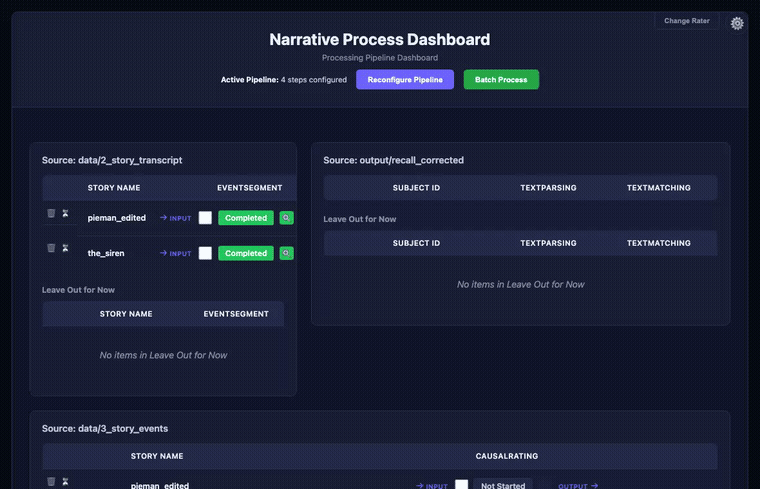
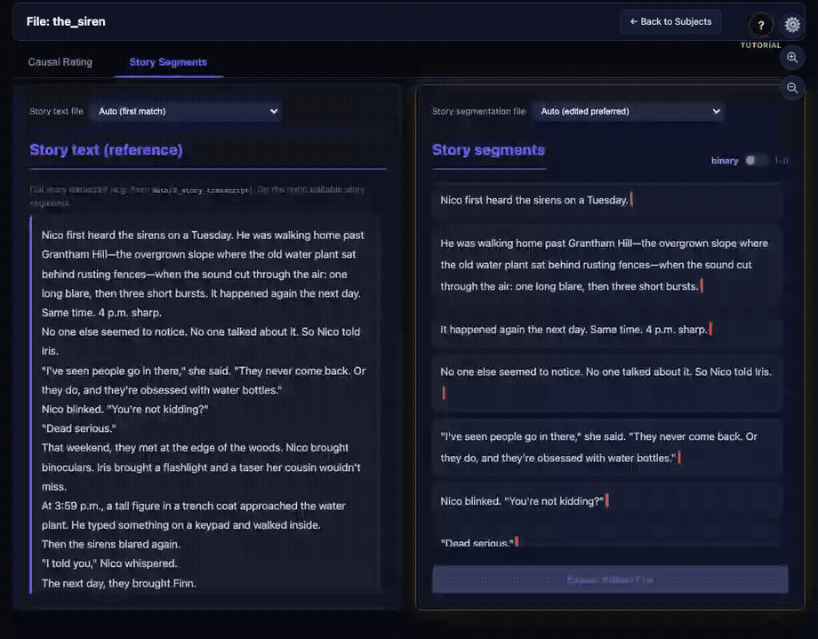
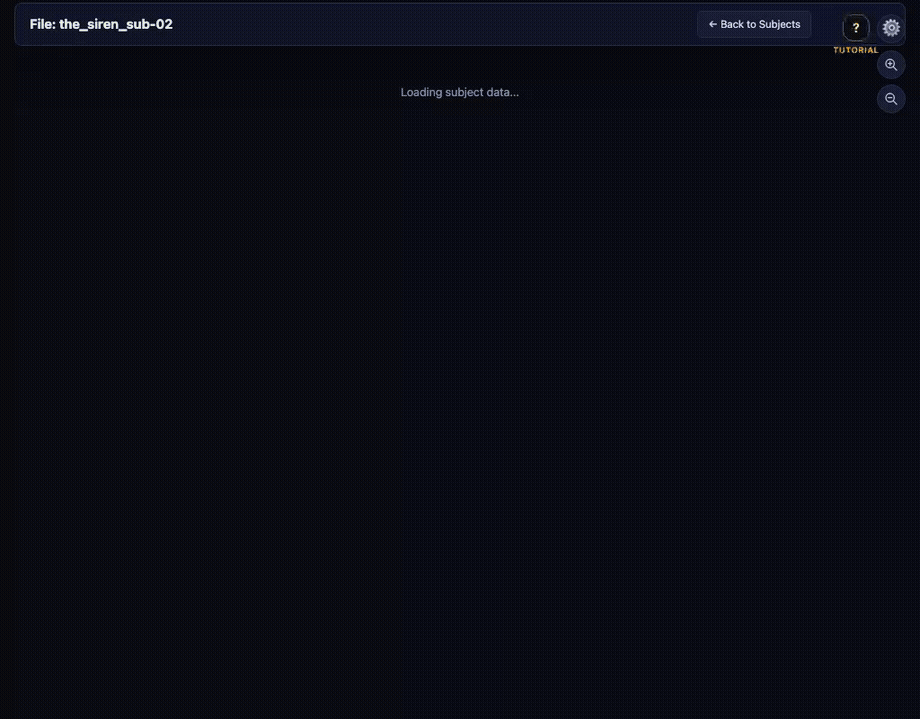
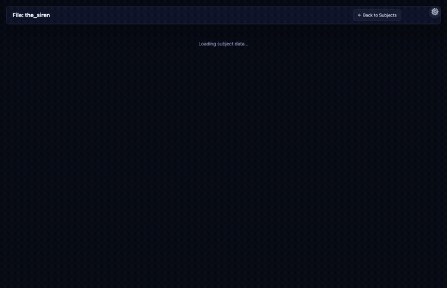

<p align="center">
  
</p>

<h1 align="center">narRaters</h1>

<h3 align="center">Turn complex narratives into structured, reviewable data — with a web UI at every step</h3>

<p align="center"><strong>GitHub:</strong> <a href="https://github.com/xianNeuro/narRaters">github.com/xianNeuro/narRaters</a> · <strong>PyPI:</strong> <a href="https://pypi.org/project/narraters/">narraters</a></p>

<p align="center">
  <a href="https://pypi.org/project/narraters/"></a>
  <a href="https://github.com/xianNeuro/narRaters"></a>
  <a href="LICENSE"></a>
  <a href="https://github.com/xianNeuro/narRaters/issues"></a>
</p>

<p align="center">
  <a href="https://xianneuro.github.io/narRaters/">🏠 Project home</a>
  ·
  <a href="https://pypi.org/project/narraters/">📦 PyPI</a>
  ·
  <a href="narRater_Tutorial.pdf">📖 Tutorial (PDF)</a>
  ·
  <a href="https://github.com/xianNeuro/narRaters/issues">🐛 Issues</a>
  ·
  <a href="https://github.com/xianNeuro/narRaters/issues/new?template=feedback">💬 Feedback</a>
</p>

<p align="center">
  <strong>README</strong> &nbsp;·&nbsp;
  <a href="docs/install.md">Install</a> &nbsp;·&nbsp;
  <a href="docs/input-data.md">Input data</a> &nbsp;·&nbsp;
  <a href="docs/web-interface.md">Web interface</a> &nbsp;·&nbsp;
  <a href="docs/troubleshooting.md">Troubleshooting</a> &nbsp;·&nbsp;
  <a href="docs/command-line.md">Command-line</a> &nbsp;·&nbsp;
  <a href="LICENSE">License</a>
</p>

<br>

## What is narRaters?

**narRaters** (*narrative* + *raters*) is an open-source software on [GitHub (xianNeuro/narRaters)](https://github.com/xianNeuro/narRaters) that helps process complex narratives (e.g., audio book, text-based stories, interviews, conversations, etc.) for memory, language processing, causal reasoning, and LLM research.

Imagine you ran a memory study: participants listened to a story, then recalled what they remembered (spoken or typed). Before you can analyze memory, you need structured data — what happened in the story, what each person recalled, and how those pieces connect.

**narRaters** helps you get there. It runs common narrative-processing steps (transcribe audio, split a story into events, clean up recall text, parse recalls into clauses, match recalls back to story events, rate causal links between events) and gives you a web interface to review and fix outputs before exporting.

Works for audio or text, stories or other long narratives (including movie annotations), and human-only or human-vs-LLM workflows.

| You have… | narRaters helps you… |
|---|---|
| Story audio or transcript | Transcribe it and break it into numbered **events** |
| Participant recall files | Correct spelling, split into **clauses**, and **match** each clause to story events |
| A segmented story | **Rate causal links** between event pairs (did event A lead to event B?) |
| Automated or AI outputs | **Screen and edit** them in the browser, then export signed-off files |

<p align="center">
  
</p>

---

## Get started in 3 steps

<table>
  <tr>
    <td width="72" align="center"><strong>1</strong></td>
    <td><strong>Download & open</strong><br>Get the <a href="https://github.com/xianNeuro/narRaters/archive/refs/tags/v0.3.8.zip">ZIP</a>, unzip, and double-click <code>narRater.app</code> (macOS) or <code>narRaters_installer.bat</code> (Windows). Needs <a href="https://www.python.org/downloads/">Python 3.10+</a>.</td>
  </tr>
  <tr>
    <td align="center"><strong>2</strong></td>
    <td><strong>Pick your pipeline</strong><br>Your browser opens to the pipeline builder. Drag in only the steps you need (e.g. segment → match → causal rate). Bundled demo data is already loaded so you can explore immediately.</td>
  </tr>
  <tr>
    <td align="center"><strong>3</strong></td>
    <td><strong>Run, review, export</strong><br>On the dashboard, click a cell to run a step. Open the magnifying-glass icon to inspect results, edit in the browser, and export when you are satisfied.</td>
  </tr>
</table>

<p><strong>Or via terminal</strong> (Python 3.10+; no ZIP download). Run from the folder that contains your <code>data/</code> and <code>output/</code> directories (or set <code>NARRATERS_PROJECT_ROOT</code> to that path):</p>

```bash
python --version                              # must show 3.10 or newer
python3 -m pip install narraters --upgrade    # wait for “Successfully installed”
cd /path/to/your/project                      # folder with data/ and output/
narraters serve                               # browser opens to the pipeline builder
```

Then continue with **steps 2–3** above — pick your pipeline, run steps on the dashboard, review, and export.

> **First time?** Follow the illustrated **[Tutorial PDF](narRater_Tutorial.pdf)** or jump to [Install](docs/install.md#quick-start) for setup and troubleshooting.

---

## See the app

<p align="center">
  
  <br>
  <em>① Build a pipeline &nbsp;→&nbsp; ② Dashboard &nbsp;→&nbsp; ③ Rate causal links</em>
</p>

<table>
  <tr>
    <td align="center" width="25%" valign="top">
      <p><strong>① Pipeline dashboard</strong></p>
      <br>
      <sub>See every subject/story, run steps, and open results. Green = done; click a cell to process.</sub>
    </td>
    <td align="center" width="25%" valign="top">
      <p><strong>② Event segmentation</strong></p>
      <br>
      <sub>Move the cursor through the text and click to drop boundary bars. Toggle <em>binary</em> or <em>1–5</em> strength (bar colored blue→red).</sub>
    </td>
    <td align="center" width="25%" valign="top">
      <p><strong>③ Recall matching</strong></p>
      <br>
      <sub>Story events on the left; recall segments on the right. Assign which events each recall segment refers to.</sub>
    </td>
    <td align="center" width="25%" valign="top">
      <p><strong>④ Causal rating</strong></p>
      <br>
      <sub>Click a grid cell to rate how strongly one story event caused another (0–3 scale).</sub>
    </td>
  </tr>
</table>

---

## Table of contents

- [What is narRaters?](#what-is-narraters)
- [Get started in 3 steps](#get-started-in-3-steps)
- [See the app](#see-the-app)
- [Install](docs/install.md) — quick start and full installation walkthrough
- [Input data](docs/input-data.md) — where to put your files
- [Web interface](docs/web-interface.md) — navigating the three main screens
- [Troubleshooting](docs/troubleshooting.md)
- [Pipeline overview](#pipeline-overview)
- [Command-line pipeline](docs/command-line.md)
- [Prompt templates](#prompt-templates)
- [Validation / testing](#validation--testing)
- [Research background](#research-background)
- [Library / Python use](#library--python-use)
- [Project layout](#project-layout)
- [Further reading](#further-reading)
- [Author](#author)
- [Acknowledgements](#acknowledgements)
- [License](LICENSE)

---

## Pipeline overview

**Six optional steps — use any subset, in any order.** Each step can run automatically (rules, local models, or cloud APIs) and then be reviewed in the browser.

| Plain English | Step ID | Input → output (typical) |
|---|---|---|
| Transcribe audio | **`audioTranscribe`** | audio file → text transcript |
| Split story into events | **`eventSegment`** | story transcript → numbered event list |
| Fix recall spelling/grammar | **`sentenceCorrect`** | raw recall text → corrected text |
| Split recall into clauses | **`textParsing`** | corrected recall → clause segments |
| Match recall to story | **`textMatching`** | recall segments + story events → rated matches |
| Rate event causality | **`causalRating`** | story events → cause–effect ratings |

<details>
<summary><strong>Full step reference (commands &amp; folders)</strong></summary>

In typical recall work, **`audioTranscribe`** / **`eventSegment`** target the **story**, **`sentenceCorrect`**–**`textMatching`** each **subject recall**, and **`causalRating`** the **story event list** — but text-only projects skip Step 1, and you can equally run just **`eventSegment` + `causalRating`** or **`sentenceCorrect` → `textParsing` → `textMatching`**. Every step is available from the **GUI** or **`narraters` CLI**, has a lightweight default method, and supports hand-editing afterward.

| # | Step ID | What it does | Terminal command | Default in / out |
|---|---------|--------------|------------------|------------------|
| 1 | **`audioTranscribe`** | Audio recordings → text (Whisper/WhisperX); story vs recall via `audioScope` or `--kind` | `narraters transcribe` | `data/4_recall_audio/` (or `data/1_story_audio/` with `--kind story`) → `output/*_audio-transcribed/` |
| 2 | **`eventSegment`** | Story transcript → numbered events | `narraters segment` | `data/2_story_transcript/` → `data/3_story_events/` |
| 3 | **`sentenceCorrect`** | Fix spelling/grammar in recall text (no rewriting) | `narraters correct` | `data/5_recall_texts/` → `output/recall_corrected/` |
| 4 | **`textParsing`** | Corrected recall → clause-level segments | `narraters parse` | `output/recall_corrected/` → `output/recall_parsed/` |
| 5 | **`textMatching`** | Recall segments ↔ story events | `narraters match` | `output/recall_parsed/` + `data/3_story_events/` → `output/recall_rated/` |
| 6 | **`causalRating`** | Causal strength of every story-event pair | `narraters rate` | `data/3_story_events/` → `output/causal_rated/` |

</details>

For each step, the GUI runs the same backends as the CLI. **Available methods, flags, and examples** are under **[Command-line pipeline](docs/command-line.md)**.

---

## Prompt templates

LLM-backed methods load text from **`scripts/prompt/`** (you can add versions or override paths; see [`scripts/prompt/README.md`](scripts/prompt/README.md)). Bundled templates:

| File | Step | Used by |
|---|---|---|
| `event_segment.txt` | 2 — segment | `--method api` |
| `spell_gram.txt` | 3 — correct | `--method gemma-ollama` |
| `recall_parse_clause.txt` | 4 — parse | `--method ollama` |
| `recall_rating.txt` | 5 — match | `--method api`, `--method gemma-ollama` |
| `causal_rating.txt` | 6 — rate | `--method api` |

You can:

- **Browse available versions** with `narraters <step> --list-prompts`
- **Select a version** with `--prompt-version <name>`
- **Override the file directly** for Step 3 with `--prompt-file path/to/prompt.txt`
- **Add your own** by dropping a new `.txt` into `scripts/prompt/` — it's picked up automatically

---

## Validation / testing

There is no bundled **pytest** suite. Use the **helper scripts** under `helpers/` for smoke checks and regression-style runs, for example:

```bash
python helpers/test_recall_rater_single_subject.py
python helpers/test_story_event_segment.py
python helpers/test_recall_rater_all_stories.py
python helpers/test_bar_metrics_all_rated.py
```

The dashboard **caches each output directory's listing once per page request** and reuses it for every cell in the status grid, instead of scanning the disk again for each subject and step separately — noticeable on large studies.

---

## Research background

Citations below motivate or validate **automated** approaches similar to the optional narRaters methods (numbered to match the [pipeline overview](#pipeline-overview)). Your study still needs design-appropriate evaluation.

**Step 1 — `audioTranscribe`** &nbsp;No paper cited; validation is Whisper/WhisperX accuracy on your audio plus manual spot checks.

**Step 2 — `eventSegment`** &nbsp;Michelmann, Kumar, **Norman**, & Toneva, *Large language models can segment narrative events similarly to humans*: GPT-3 zero-shot boundaries correlate with human segmentations and approximate crowd consensus — useful precedent for LLM-based story segmentation. [arXiv:2301.10297](https://arxiv.org/abs/2301.10297), [Behavior Research Methods (2025)](https://doi.org/10.3758/s13428-024-02569-z), [code](https://github.com/s-michelmann/GPT_event_segmentation).

**Step 3 — `sentenceCorrect`** &nbsp;No external benchmark; the package enforces minimal, non-paraphrasing edits.

**Step 4 — `textParsing`** &nbsp;Clause-level structure is checked against the same independent-clause logic as `eventSegment`.

**Step 5 — `textMatching`**
- Toneva et al., *Memory for long narratives* (Princeton Computational Memory Lab, 2021; with **K. A. Norman**): long-form novel recall scored by aligning recalled events to chapter events with GPT-2 representations. [PDF](https://compmem.princeton.edu/wp/wp-content/uploads/2022/05/memory-for-long-narratives.pdf).
- **rMatch** — Kressin Palacios & Arekar: embedding-based recall-to-event matching with human-data validation. [GabrielKP/rMatch](https://github.com/GabrielKP/rMatch).

**Step 6 — `causalRating`** &nbsp;Li et al., *Agency personalizes episodic memories* (PsyArXiv, 2024): behavioral work with choose-your-own-adventure narratives examining how agency shapes memory for branching event sequences — aligned with event-wise materials for which pairwise causal ratings are meaningful. [DOI:10.31234/osf.io/7evwj](https://doi.org/10.31234/osf.io/7evwj).

---

## Library / Python use

```python
from narraters import __version__, project_root
print(__version__, project_root())
```

Direct per-step imports are planned for a future release; for now, programmatic use should call the CLI via `subprocess` or import the modules under `scripts/`.

---

## Project layout

After unzipping, your `narRaters/` folder has three layers:

**1. What you click and read** — at the top of the folder so it's the first thing you see.

| File / folder | Purpose |
|---|---|
| `README.md`, `LICENSE` | this file and the license |
| `narRater_Tutorial.pdf` | illustrated end-user tutorial |
| `narRater.app` | macOS double-click launcher |
| `narRaters_installer.bat` | Windows double-click launcher |
| `install.sh` | macOS / Linux command-line installer |
| `data/` | your inputs (bundled `pieman_edited` + `the_siren` examples) |
| `output/` | pipeline outputs (sample outputs for the same examples) |

**2. App machinery** — runs the pipeline; usually no need to open these.

| File / folder | Purpose |
|---|---|
| `pyproject.toml` | package metadata, deps, console scripts |
| `src/narraters/` | installed package (`cli.py` entry point, `paths.py` repo-root resolution) |
| `scripts/` | the six pipeline scripts (`1_audio-transcribe.py` … `6_causal-rater.py`) and `prompt/` templates |
| `server/web-interface.py` | Flask web UI (routes, subprocess orchestration) |
| `templates/`, `static/` | HTML / CSS / JS / icon for the web UI |
| `helpers/` | shared utilities (disk/RAM preflight, plotting, smoke-test scripts) |

**3. Build & extras** — only relevant if you're packaging or contributing.

| File / folder | Purpose |
|---|---|
| `packaging/macos/` | scripts that build `narRater.app` and the DMG |
| `demo/` | smaller alternate dataset (lighthouse story) |
| `SETUP_API.md` | API key and provider setup |
| `.env.example` | template for local API keys (copy to `.env`) |

---

## Further reading

- **[Project home (GitHub Pages)](https://xianneuro.github.io/narRaters/)** — landing page for search and sharing.
- **[`narRater_Tutorial.pdf`](narRater_Tutorial.pdf)** — illustrated, click-by-click tour of the web UI; good next step after [Install](docs/install.md#quick-start).
- **[`SETUP_API.md`](SETUP_API.md)** — API keys for Anthropic, OpenAI, and Hugging Face; which pipeline steps need which.
- **[`scripts/prompt/README.md`](scripts/prompt/README.md)** — prompt template conventions for LLM-backed methods.

---

## Author

**Xian Li** — [xianl.cogneuro@gmail.com](mailto:xianl.cogneuro@gmail.com)

---

## Acknowledgements

- **Janice Chen** for brainstorming the causal-rating step interface and for help testing and improving package functionality.
- **Gabi Kressin Palacios** and **Dhruva Arekar** for an additional method for the recall-matching step (matching human recall text to story events). See [GabrielKP/rMatch](https://github.com/GabrielKP/rMatch) for human-data–validated AI-assisted recall rating.
- **Xiyu Li (Rita)** for contributions to the `recall_rating` prompt development and for validating model performance on human recall data (commercial LLM APIs were close to human raters).
- **Sebastian Michelmann** for feedback on the event-segmentation step (see [Michelmann et al., 2023](https://arxiv.org/abs/2301.10297)).
- **Colette Youstra** and **Quinton Covington** for testing the app's manual-rating functions.
- **Samira Tavassoli** and **Yuye Huang** for help testing the app's segmentation and causal-reasoning functions.

---

## License

See **[LICENSE](LICENSE)** — **narRaters Research and Non-Commercial License**. Free for research, education, and other non-commercial use; commercial or for-profit use requires prior written permission. Contact [xianl.cogneuro@gmail.com](mailto:xianl.cogneuro@gmail.com) for commercial licensing.
